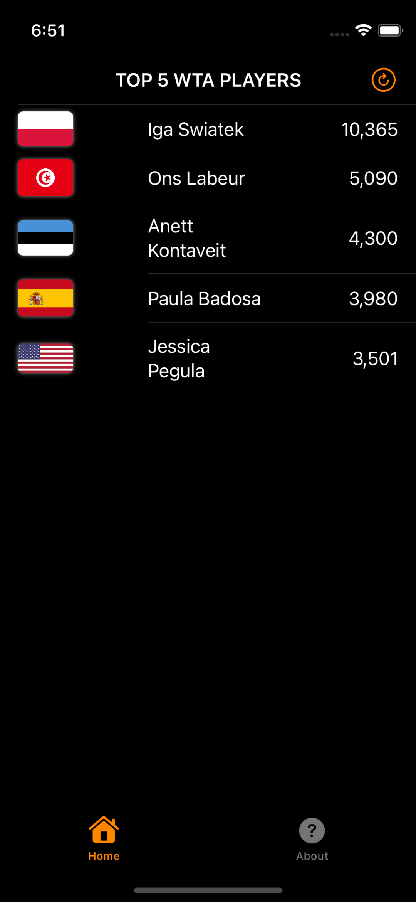

# iOS-WtaRanking
iOS app - WtaRanking. Created using SwiftUI.

<table>
  <tr>
  <td></td>
  </tr>
 </table>

Demonstrating CloudKit usage with iOS application. Applying Clean architecture with modern Swift Concurrency (Async/Await) for fetching remote Records from CloudKit Container and displaying results using SwiftUI based interface.

Target: iOS15

Stack: SwiftUI, Async/Await, CloudKit, SwiftGen (strongly typed assets), MVVM/Viper (Clean Architecture).

Creating custom CloudKit Container:
1. Proceed to https://developer.apple.com
2. Open Account -> Certificates, IDs & Profiles -> Identiefiers
3. Tap + Button to register new identifier
4. From list of identifiers select iCloud Containers
5. Give your new container description and proper identifier (follow Apple’s best practice with reverse-domain style string). Click Continue and Register

6. Login to CloudKit http://icloud.developer.apple.com
7. Open CloudKit Database
8. Make sure your recently created container is selected (top left corner)
9. Proceed to Schema / Record Types and tap on + to create new Record Type (which is equivalent of Table)
10. Name the Record Type appropriately and add fields

11. Proceed to Schema / Indexes and open recently created Record Type
12. Click on + Add Basic Index and create following two indexes:

a) For Field recordName create Queryable index type

b) For any other field create Sortable index type

13. Open Data / Records and tap on + to add new record
14. From new Record prompt select your record type, make sure to use Public Database and fill Fields with valid data
15. Verify added data by clicking on Query Records (make sure Record Type is selected)

16. In Xcode add new Capability - iCloud
17. Tick CloudKit from Services and select your Container identifier
